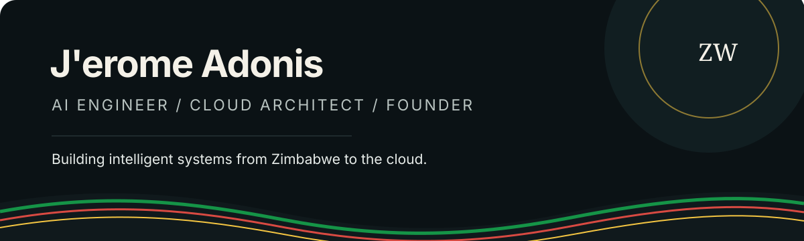

  

  <a href="https://jeromeadoniszw.web.app">Portfolio</a>
  &nbsp;&nbsp;•&nbsp;&nbsp;
  <a href="https://spiritustec.com">Spiritus</a>
  &nbsp;&nbsp;•&nbsp;&nbsp;
  <a href="https://www.linkedin.com/in/jeromeadonis">LinkedIn</a>

 

## Hello, I'm J'erome.

I am a Zimbabwean-born engineer building at the intersection of **agentic AI, cloud architecture, and human-centered products**.

Before engineering, I competed as a tennis player for Zimbabwe. I brought the same discipline into computer science, graduated with a **4.0 GPA**, and built technology at **AWS, Bank of America, and EY**.

I now create intelligent systems that make complex technology useful to real people, with a particular focus on learners, small businesses, African markets, and communities often left out of the design process.

> I do not build AI to replace human capability. I build systems that expand it.

 

## My work, in four words

| **Intelligent** | **Scalable** | **Human** | **Accessible** |
|:---:|:---:|:---:|:---:|
| AI agents that reason and act | Cloud systems built to grow | Products shaped around real behavior | Technology designed beyond the default user |

 

## Selected projects

<table>
<tr>
<td width="50%" valign="top">

### EDITH Evolution

Enterprise multi-agent knowledge and document review system built during my AWS internship.

**Impact:** 20% less weekly admin work and 40% faster validation

`Bedrock` `Strands Agents` `Lambda` `DynamoDB`

</td>
<td width="50%" valign="top">

### [Tinker](https://github.com/Adonis278/Tinker)

An AI tutor that guides students toward understanding instead of simply giving them answers.

[Live product](https://tinkersas.web.app)

`Next.js` `Firebase` `NVIDIA APIs`

</td>
</tr>
<tr>
<td width="50%" valign="top">

### CivicLens AI

Makes government information easier to understand through plain language, translation, and audio.

**2nd Place:** InternXL AI Innovation Challenge

[Live product](https://civic-lens-ai7.lovable.app/)

`React` `Firebase` `LLM APIs` `TTS`

</td>
<td width="50%" valign="top">

### [Bloom](https://github.com/Adonis278/Bloom-ABA)

Task initiation support for neurodivergent students who may be stuck within their coursework.

[Live product](https://bloom-aba.web.app)

`React` `Firebase` `Cloud Functions`

</td>
</tr>
<tr>
<td width="50%" valign="top">

### [WealthBridge](https://github.com/Adonis278/WealthBridge)

Helps people understand credit, build better financial habits, and turn financial data into useful guidance.

[Live product](https://wealthbridge.web.app)

`Next.js` `TypeScript` `Firebase`

</td>
<td width="50%" valign="top">

### RemiBand

AI-enabled wound monitoring wearable designed to help patients stay ahead of complications.

**Finalist:** Propel Future of Tech Challenge

`Sensors` `Cloud Telemetry` `AI` `Apple Health`

</td>
</tr>
</table>

EDITH is an internal production tool developed during my AWS internship. Architecture and impact are shared as a sanitized case study. Proprietary code and data remain private.

 

## Where I have built

| | Role | Focus |
|---|---|---|
| **AWS** | Solutions Architect Intern | Agent orchestration, serverless architecture, knowledge systems, deployment and observability |
| **Bank of America** | Software Engineering Intern | Java services, automated testing, Python automation |
| **EY** | FSO Technology Consultant Intern | Cloud operations, data analysis, applied machine learning |

 

## Toolkit

`Python` &nbsp; `Java` &nbsp; `TypeScript` &nbsp; `JavaScript` &nbsp; `SQL` &nbsp; `C++`

`Amazon Bedrock` &nbsp; `Strands Agents` &nbsp; `FastAPI` &nbsp; `Spring Boot` &nbsp; `Next.js` &nbsp; `Firebase`

`Lambda` &nbsp; `S3` &nbsp; `DynamoDB` &nbsp; `OpenSearch` &nbsp; `EventBridge` &nbsp; `CloudWatch`

 

## Beyond the code

**NSBE Chapter President** &nbsp;•&nbsp; **Blue Bear Hack Founder** &nbsp;•&nbsp; **HBCU Battle of the Brains Finalist**

**University Innovation Fellow** &nbsp;•&nbsp; **InternXL 2nd Place Winner** &nbsp;•&nbsp; **Former Zimbabwe national-level tennis player**

 

  <strong>Building from experience. Designing for people. Scaling through technology.</strong>

  <a href="https://www.linkedin.com/in/jeromeadonis">Let's connect on LinkedIn</a>

